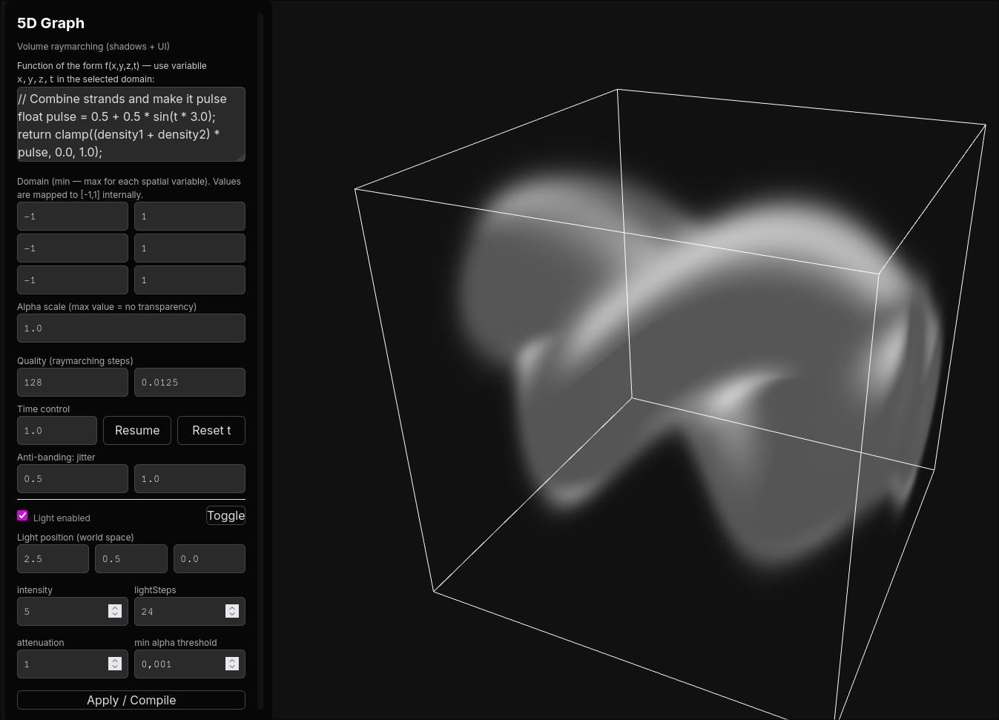
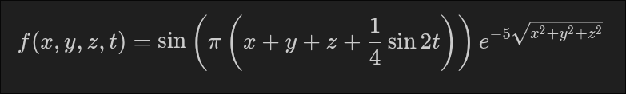
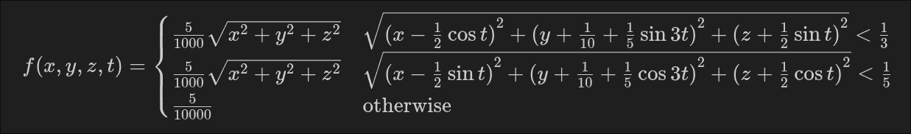

# 5-dimensional graph renderer
Consider a function $f\colon\mathbb{R}^4 \to \mathbb{R}$. The graph of $f$
lives in the $(x,y,z,t,f(x,y,z,t)) \in \mathbb{R}^5$ plane.
The graph is represented using a density cube.
The spatial parameters $(x,y,z)$ are represented at the position
$(x,y,z)$ in the cube, while $t$ varies over time.
This means that the value of $f(x,y,z,t)$ for a given set of inputs,
is represented by the transparency value at the coordinates $(x,y,z)$ of the cube at the instant $t$.
The density is rendered using ray marching techniques.



# Examples

## Sinusoidal slices


```glsl
return sin(3.14159*(x+y+z+0.25*sin(t*2.0))) * exp(-5.0*length(vec3(x,y,z)));
```

## Moving spheres


```glsl
if (length(vec3(x-cos(t) * 0.5,y + sin(t*3.0) * 0.2 + 0.1,z+sin(t) * 0.5)) < 0.3) {
    return 1.0 / length(vec3(x,y,z)) * 0.005;
}
if (length(vec3(x-sin(t) * 0.5,y + cos(t*2.0) * 0.2 - 0.1,z+cos(t) * 0.5)) < 0.2) {
    return 1.0 / length(vec3(x,y,z)) * 0.005;
}
return 0.0005;
```

## Pulsating double-helix

```glsl
float radius = 0.4 + 0.05 * sin(t * 0.7); // helix radius varies
float twistSpeed = 1.0;                   // rotation speed
float helixHeight = 1.0;                  // vertical scale

// Rotate coordinates over time
float angle = twistSpeed * t + z * 3.0;
float hx1 = cos(angle) * radius;
float hy1 = sin(angle) * radius;

float hx2 = cos(angle + 3.1416) * radius; // opposite strand
float hy2 = sin(angle + 3.1416) * radius;

// Distance to each strand's center line
float d1 = length(vec2(x - hx1, y - hy1 * helixHeight));
float d2 = length(vec2(x - hx2, y - hy2 * helixHeight));

// Gaussian falloff for smooth density (0<f<1)
float density1 = exp(-20.0 * d1 * d1);
float density2 = exp(-20.0 * d2 * d2);

// Combine strands and make it pulse
float pulse = 0.5 + 0.5 * sin(t * 3.0);
return clamp((density1 + density2) * pulse, 0.0, 1.0);
```

## Pulsating torus

```glsl
float R = 0.5 + 0.1 * sin(t * 0.8); // main radius
float r = 0.15 + 0.05 * cos(t * 1.5); // tube radius

// Center of torus drifts
vec3 center = vec3(0.3 * sin(t * 0.5),
                    0.2 * sin(t * 0.9),
                    0.3 * cos(t * 0.4));
vec3 pp = vec3(x, y, z) - center;

// Distance to torus surface
float q = length(vec2(length(pp.xz) - R, p.y));

// Smooth Gaussian falloff from surface
float density = exp(-40.0 * q * q);

// Add a soft breathing/pulsating effect
float pulse = 0.6 + 0.4 * sin(t * 2.0 + length(pp) * 5.0);

return clamp(density * pulse, 0.0, 1.0);
```

## Spiky ball

```glsl
vec3 center = vec3(0.2 * sin(t * 0.4),
                    0.2 * cos(t * 0.3),
                    0.2 * sin(t * 0.5 + 1.0));
vec3 pp = vec3(x, y, z) - center;

// Base sphere radius
float baseRadius = 0.35;

// Direction and length
float len = length(pp);
vec3 dir = normalize(pp);

// Spiky surface: use dot product patterns for pseudo-noise
float spikes = sin(dot(dir, vec3(3.1, 5.2, 7.3)) * 15.0 + t * 3.0)
                + sin(dot(dir, vec3(-4.2, 2.8, 6.5)) * 12.0 - t * 2.5);

spikes *= 0.02; // spike height

// Distance from spiky surface
float surfaceDist = abs(len - (baseRadius + spikes));

// Sharp Gaussian around the spiky shell
float density = exp(-300.0 * surfaceDist * surfaceDist);

// Subtle flicker for energy effect
float flicker = 0.8 + 0.2 * sin(t * 20.0 + len * 10.0);

return clamp(density * flicker, 0.0, 1.0);
```