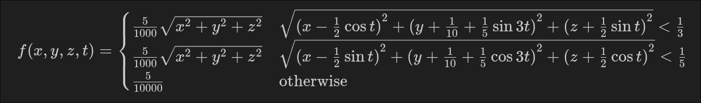

# 5-dimensional graph renderer
Consider a function $f\colon\mathbb{R}^4 \to \mathbb{R}$. The graph of $f$
lives in the $(x,y,z,t,f(x,y,z,t)) \in \mathbb{R}^5$ plane.
The graph is represented using a density cube.
The spatial parameters $(x,y,z)$ are represented at the position
$(x,y,z)$ in the cube, while $t$ varies over time.
This means that the value of $f(x,y,z,t)$ for a given set of inputs,
is represented by the transparency value at the coordinates $(x,y,z)$ of the cube at the instant $t$.
The density is rendered using ray marching techniques.

## Example 1


https://github.com/user-attachments/assets/1f14867e-7f72-42b7-9472-da8c6397f36c


$$f(x,y,z,t) = \sin\left(\pi\left(x+y+z+\frac{1}{4}\sin 2t\right)\right) e^{-5 \sqrt{x^2 + y^2 + z^2}}$$
<br>
Code:
```glsl
return sin(3.14159*(x+y+z+0.25*sin(t*2.0))) * exp(-5.0*length(vec3(x,y,z)));
```

## Example 2


https://github.com/user-attachments/assets/cd9e1b30-c974-4c84-ac39-a50a0419b848



<br>
Code:

```glsl
if (length(vec3(x-cos(t) * 0.5,y + sin(t*3.0) * 0.2 + 0.1,z+sin(t) * 0.5)) < 0.3) {
    return 1.0 / length(vec3(x,y,z)) * 0.005;
}
if (length(vec3(x-sin(t) * 0.5,y + cos(t*2.0) * 0.2 - 0.1,z+cos(t) * 0.5)) < 0.2) {
    return 1.0 / length(vec3(x,y,z)) * 0.005;
}
return 0.0005;
```
