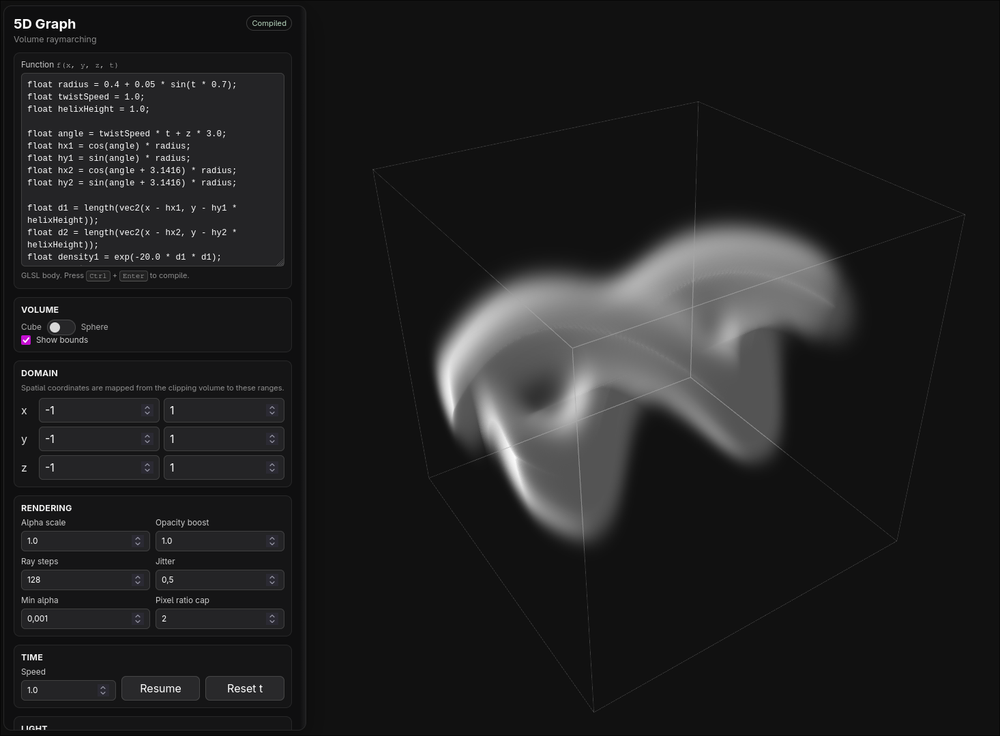

# 5-dimensional graph renderer

Consider a function $f\colon\mathbb{R}^4 \to \mathbb{R}$. The graph of $f$ lives in the $(x,y,z,t,f(x,y,z,t)) \in \mathbb{R}^5$ space.
The graph is represented using a density cube.
The spatial parameters $(x,y,z)$ are represented at the position $(x,y,z)$ in the cube, while $t$ varies over time.
This means that the value of $f(x,y,z,t)$ for a given set of inputs is represented by the transparency value at the coordinates $(x,y,z)$ of the cube at the instant $t$.
The density is rendered using ray marching techniques.



# Examples

## Sinusoidal slices

$$
f(x,y,z,t)=
\sin\left(\pi\left(x+y+z+\frac14\sin(2t)\right)\right)
e^{-5\sqrt{x^2+y^2+z^2}}.
$$

```glsl
return sin(3.14159*(x+y+z+0.25*sin(t*2.0))) * exp(-5.0*length(vec3(x,y,z)));
```

## Moving spheres

$$
f(x,y,z,t)=
\begin{cases}
\dfrac{0.005}{\sqrt{x^2+y^2+z^2}},
&
\sqrt{\left(x-\frac12\cos t\right)^2+\left(y+\frac15\sin(3t)+\frac1{10}\right)^2+\left(z+\frac12\sin t\right)^2}<0.3,
\\[1em]
\dfrac{0.005}{\sqrt{x^2+y^2+z^2}},
&
\sqrt{\left(x-\frac12\sin t\right)^2+\left(y+\frac15\cos(2t)-\frac1{10}\right)^2+\left(z+\frac12\cos t\right)^2}<0.2,
\\[1em]
0.0005,
&
\text{otherwise}.
\end{cases}
$$

```glsl
if (length(vec3(x-cos(t)*0.5, y+sin(t*3.0)*0.2+0.1, z+sin(t)*0.5)) < 0.3) {
    return 1.0 / length(vec3(x,y,z)) * 0.005;
}
if (length(vec3(x-sin(t)*0.5, y+cos(t*2.0)*0.2-0.1, z+cos(t)*0.5)) < 0.2) {
    return 1.0 / length(vec3(x,y,z)) * 0.005;
}
return 0.0005;
```

## Pulsating double-helix

Let

$$
\rho(t)=0.4+0.05\sin(0.7t), \qquad \theta(z,t)=t+3z.
$$

The squared distances from the two strands are

$$
d_1^2=\left(x-\rho(t)\cos\theta\right)^2+\left(y-\rho(t)\sin\theta\right)^2,
$$

$$
d_2^2=\left(x+\rho(t)\cos\theta\right)^2+\left(y+\rho(t)\sin\theta\right)^2.
$$

Then

$$
f(x,y,z,t)=
\mathrm{clamp}\left(
\left(e^{-20d_1^2}+e^{-20d_2^2}\right)
\left(\frac12+\frac12\sin(3t)\right),
0,1
\right).
$$

```glsl
float radius = 0.4 + 0.05 * sin(t * 0.7); // helix radius varies
float twistSpeed = 1.0;                   // rotation speed
float helixHeight = 1.0;                  // vertical scale
// Rotate coordinates over time
float angle = twistSpeed * t + z * 3.0;
float hx1 = cos(angle) * radius;
float hy1 = sin(angle) * radius;
float hx2 = cos(angle + 3.1416) * radius; // opposite strand
float hy2 = sin(angle + 3.1416) * radius;
// Distance to each strand's center line
float d1 = length(vec2(x - hx1, y - hy1 * helixHeight));
float d2 = length(vec2(x - hx2, y - hy2 * helixHeight));
// Gaussian falloff for smooth density (0<f<1)
float density1 = exp(-20.0 * d1 * d1);
float density2 = exp(-20.0 * d2 * d2);
// Combine strands and make it pulse
float pulse = 0.5 + 0.5 * sin(t * 3.0);
return clamp((density1 + density2) * pulse, 0.0, 1.0);
```

## Pulsating torus

Let

$$
R(t)=0.5+0.1\sin(0.8t)
$$

and

$$
\mathbf c(t)=
\begin{pmatrix}
0.3\sin(0.5t)\\
0.2\sin(0.9t)\\
0.3\cos(0.4t)
\end{pmatrix}.
$$

Define

$$
\mathbf p=
\begin{pmatrix}
x\\
y\\
z
\end{pmatrix}
-\mathbf c(t)
$$

and

$$
q=\sqrt{\left(\sqrt{p_x^2+p_z^2}-R(t)\right)^2+p_y^2}.
$$

Then

$$
f(x,y,z,t)=
\mathrm{clamp}\left(
e^{-40q^2}
\left(0.6+0.4\sin\left(2t+5\lVert\mathbf p\rVert\right)\right),
0,1
\right).
$$

```glsl
float R = 0.5 + 0.1 * sin(t * 0.8); // main radius
// Center of torus drifts
vec3 center = vec3(0.3 * sin(t * 0.5),
                   0.2 * sin(t * 0.9),
                   0.3 * cos(t * 0.4));
vec3 pp = vec3(x, y, z) - center;
// Distance to torus surface
float q = length(vec2(length(pp.xz) - R, pp.y));
// Smooth Gaussian falloff from surface
float density = exp(-40.0 * q * q);
// Add a soft breathing/pulsating effect
float pulse = 0.6 + 0.4 * sin(t * 2.0 + length(pp) * 5.0);
return clamp(density * pulse, 0.0, 1.0);
```

## Spiky ball

Let

$$
\mathbf c(t)=
\begin{pmatrix}
0.2\sin(0.4t)\\
0.2\cos(0.3t)\\
0.2\sin(0.5t+1)
\end{pmatrix},
\qquad
\mathbf p=
\begin{pmatrix}
x\\
y\\
z
\end{pmatrix}
-\mathbf c(t).
$$

Define

$$
r=\lVert\mathbf p\rVert,
\qquad
\widehat{\mathbf p}=\frac{\mathbf p}{\lVert\mathbf p\rVert}.
$$

The surface perturbation is

$$
s(\mathbf p,t)=
0.02\left[
\sin\left(15\,\widehat{\mathbf p}\cdot
\begin{pmatrix}
3.1\\
5.2\\
7.3
\end{pmatrix}
+3t\right)
+
\sin\left(12\,\widehat{\mathbf p}\cdot
\begin{pmatrix}
-4.2\\
2.8\\
6.5
\end{pmatrix}
-2.5t\right)
\right].
$$

Let

$$
d=\left|r-\left(0.35+s(\mathbf p,t)\right)\right|.
$$

Then

$$
f(x,y,z,t)=
\mathrm{clamp}\left(
e^{-300d^2}
\left(0.8+0.2\sin(20t+10r)\right),
0,1
\right).
$$

```glsl
vec3 center = vec3(0.2 * sin(t * 0.4),
                   0.2 * cos(t * 0.3),
                   0.2 * sin(t * 0.5 + 1.0));
vec3 pp = vec3(x, y, z) - center;
// Base sphere radius
float baseRadius = 0.35;
// Direction and length
float len = length(pp);
vec3 dir = normalize(pp);
// Spiky surface: use dot product patterns for pseudo-noise
float spikes = sin(dot(dir, vec3(3.1, 5.2, 7.3)) * 15.0 + t * 3.0)
             + sin(dot(dir, vec3(-4.2, 2.8, 6.5)) * 12.0 - t * 2.5);
spikes *= 0.02; // spike height
// Distance from spiky surface
float surfaceDist = abs(len - (baseRadius + spikes));
// Sharp Gaussian around the spiky shell
float density = exp(-300.0 * surfaceDist * surfaceDist);
// Subtle flicker for energy effect
float flicker = 0.8 + 0.2 * sin(t * 20.0 + len * 10.0);
return clamp(density * flicker, 0.0, 1.0);
```

## Concentric spheres

Let

$$
r=\sqrt{x^2+y^2+z^2}+10^{-4},
\qquad
\phi=\mathrm{atan2}(z,x),
\qquad
\theta=\mathrm{atan2}\left(y,\sqrt{x^2+z^2}\right).
$$

Define

$$
S(r,t)=e^{-18\sin^2(15r-1.8t)},
$$

$$
P(\phi,\theta,t)=
0.35+
0.65\left(
\frac12+\frac12\cos(6\phi+4\theta+0.7t)
\right)^4,
$$

and

$$
E(r)=e^{-1.15r^2}.
$$

Then

$$
f(x,y,z,t)=
\mathrm{clamp}\left(
S(r,t)P(\phi,\theta,t)E(r),
0,1
\right).
$$

```glsl
vec3 q = vec3(x, y, z);
float r = length(q) + 0.0001;
float shells =
    exp(
        -18.0 *
        pow(
            sin(15.0*r - 1.8*t),
            2.0
        )
    );
float phi = atan(q.z, q.x);
float theta = atan(q.y, length(q.xz));
float petals =
    0.35 +
    0.65 *
    pow(
        0.5 +
        0.5*cos(6.0*phi + 4.0*theta + 0.7*t),
        4.0
    );
float envelope = exp(-1.15*r*r);
return clamp(shells * petals * envelope, 0.0, 1.0);
```

## Moving Möbius strip

Let

$$
\phi=\operatorname{atan2}(y,x)+0.30t,
\qquad
\rho=\sqrt{x^2+y^2}.
$$

Define

$$
u=\rho-0.52,
\qquad
v=z,
\qquad
h=\frac{\phi}{2}.
$$

Let

$$
n=
\left|
v\cos h-u\sin h
\right|,
$$

and

$$
a=
u\cos h+v\sin h.
$$

To reproduce the GLSL smoothstep term, define

$$
s=
\operatorname{clamp}
\left(
\frac{|a|-0.18}{0.05},
0,1
\right),
$$

and

$$
W=1-s^2(3-2s).
$$

The sheet density is

$$
S=e^{-650n^2}W.
$$

For the outer rim, define

$$
d_e=
\left|
|a|-0.20
\right|,
$$

and

$$
R=
e^{-650n^2}
e^{-500d_e^2}.
$$

Then

$$
f(x,y,z,t)=
\mathrm{clamp}\left(
0.55S+R,
0,1
\right).
$$

```glsl
float phi = atan(y, x) + 0.30 * t;
float rho = length(vec2(x, y));

float u = rho - 0.52;
float v = z;

float h = 0.5 * phi;
float ch = cos(h);
float sh = sin(h);

float normalDist = abs(v * ch - u * sh);
float across = u * ch + v * sh;

float widthMask =
    1.0 - smoothstep(0.18, 0.23, abs(across));

float sheet =
    exp(-650.0 * normalDist * normalDist)
    * widthMask;

float edgeDist = abs(abs(across) - 0.20);

float rim =
    exp(-650.0 * normalDist * normalDist)
    * exp(-500.0 * edgeDist * edgeDist);

return clamp(0.55 * sheet + rim, 0.0, 1.0);
```

## Trefoil knot

Let

$$
\alpha=0.18t
$$

and rotate the $xy$-plane according to

$$
\begin{pmatrix}
\cos\alpha & \sin\alpha\
-\sin\alpha & \cos\alpha
\end{pmatrix}
\begin{pmatrix}
x\
y
\end{pmatrix},
\qquad
q_z=z.
$$

Let

$$
R=0.52,
\qquad
r_0=0.22,
$$

and define

$$
\rho=\sqrt{q_x^2+q_y^2},
$$

$$
\phi=\operatorname{atan2}(q_y,q_x),
$$

and

$$
\theta=
\operatorname{atan2}
\left(
q_z,\rho-R
\right).
$$

The distance from the torus surface is

$$
d_r=
\left|
\sqrt{(\rho-R)^2+q_z^2}
-r_0
\right|.
$$

Define the phase

$$
\Psi=
3\phi-2\theta-0.55t,
$$

and

$$
d_\phi=
1-\cos\Psi.
$$

Then

$$
\exp\left(
-800d_r^2
-7d_\phi
\right).
$$

```glsl
vec3 q = vec3(x, y, z);

float rot = 0.18 * t;
float cr = cos(rot);
float sr = sin(rot);

q.xy = mat2(cr, -sr, sr, cr) * q.xy;

float R = 0.52;
float r = 0.22;

float rho = length(q.xy);

float phi = atan(q.y, q.x);
float theta = atan(q.z, rho - R);

float torusCoord =
    length(vec2(rho - R, q.z));

float radialDist = abs(torusCoord - r);

float phase =
    3.0 * phi -
    2.0 * theta -
    0.55 * t;

float phaseDist = 1.0 - cos(phase);

float density =
    exp(
        -800.0 * radialDist * radialDist
        -7.0 * phaseDist
    );

return density;
```

## Organic sphere

Let

$$
\mathbf q=
\begin{pmatrix}
x\
y\
z
\end{pmatrix},
$$

and define

$$
r=\lVert\mathbf q\rVert+10^{-4},
\qquad
\phi=\operatorname{atan2}(y,x),
\qquad
\theta=
\arccos\left(
\mathrm{clamp}
\left(
\frac{z}{r},
-1,1
\right)
\right).
$$

The time-dependent deformation is

$$
\begin{aligned}
\delta(\phi,\theta,t)
={}&
0.055
\sin(7\phi+1.2t)
\sin(5\theta-0.7t)
\
&+
0.035
\cos(11\phi-3\theta+0.4t)
\
&+
0.020
\sin(17\theta+t).
\end{aligned}
$$

The target radius is

0.48+\delta(\phi,\theta,t).
$$

Define

$$
d=
\left|
r-R(\phi,\theta,t)
\right|,
$$

and

$$
S=e^{-550d^2}.
$$

The shimmering modulation is

0.70+
0.30
\sin\left(
16\phi+9\theta-2t
\right).
$$

Then

$$
S,M(\phi,\theta,t).
$$

```glsl
vec3 q = vec3(x, y, z);

float r = length(q) + 0.0001;

float az = atan(q.y, q.x);
float el = acos(clamp(q.z / r, -1.0, 1.0));

float deformation =
      0.055 * sin(7.0 * az + 1.2 * t)
                  * sin(5.0 * el - 0.7 * t)
    + 0.035 * cos(11.0 * az - 3.0 * el + 0.4 * t)
    + 0.020 * sin(17.0 * el + t);

float target =
    0.48 + deformation;

float d =
    abs(r - target);

float shell =
    exp(-550.0 * d * d);

float shimmer =
    0.70 +
    0.30 * sin(
        16.0 * az +
        9.0 * el -
        2.0 * t
    );

return shell * shimmer;
```

## Black hole + accretion disk

Let

$$
\alpha=0.12t
$$

and rotate the $xz$-plane according to

$$
\begin{pmatrix}
q_x\\
q_z
\end{pmatrix}
=
\begin{pmatrix}
\cos\alpha & \sin\alpha\\
-\sin\alpha & \cos\alpha
\end{pmatrix}
\begin{pmatrix}
x\\
z
\end{pmatrix},
\qquad
q_y=y.
$$

Define

$$
r=\sqrt{q_x^2+q_z^2}+10^{-4},
\qquad
\theta=\mathrm{atan2}(q_z,q_x).
$$

The spiral modulation is

$$
A=
0.45+
0.55\left(
\frac12+\frac12\sin(11\theta-18r+2.2t)
\right)^3.
$$

The accretion disk is

$$
D=e^{-100q_y^2}e^{-7(r-0.48)^2}A.
$$

The photon ring is

$$
P=e^{-350(r-0.27)^2}e^{-180q_y^2}.
$$

Let

$$
u=
\mathrm{clamp}
\left(
\frac{r-0.18}{0.11},
0,1
\right),
$$

so that the GLSL \`smoothstep\` term is

$$
H=u^2(3-2u).
$$

The polar jet is

$$
J=
e^{-40(q_x^2+q_z^2)}
e^{-1.4q_y^2}
\left(
0.55+0.45\sin^2(11q_y-3t)
\right).
$$

Finally,

$$
f(x,y,z,t)=
\mathrm{clamp}\left(
DH+0.9P+0.32J,
0,1
\right).
$$

```glsl
vec3 q = vec3(x, y, z);
float a = 0.12 * t;
float ca = cos(a);
float sa = sin(a);
q.xz = mat2(ca, -sa, sa, ca) * q.xz;
float r = length(q.xz) + 0.0001;
float ang = atan(q.z, q.x);
float spiral =
    0.45 +
    0.55 * pow(
        0.5 + 0.5*sin(11.0*ang - 18.0*r + 2.2*t),
        3.0
    );
float disk =
    exp(-100.0*q.y*q.y) *
    exp(-7.0*pow(r - 0.48, 2.0)) *
    spiral;
float photonRing =
    exp(-350.0*pow(r - 0.27, 2.0)) *
    exp(-180.0*q.y*q.y);
float hole = smoothstep(0.18, 0.29, r);
float jet =
    exp(-40.0*(q.x*q.x + q.z*q.z)) *
    exp(-1.4*q.y*q.y) *
    (0.55 + 0.45*pow(sin(11.0*q.y - 3.0*t), 2.0));
float density =
      disk * hole
    + 0.9 * photonRing
    + 0.32 * jet;
return clamp(density, 0.0, 1.0);
```

## 5D crystal structure

Let

$$
\varphi=0.45t,
\qquad
X=4.5x+\varphi,
\qquad
Y=4.5y-0.7\varphi,
\qquad
Z=4.5z+0.4\varphi.
$$

Define

$$
d=
\sin X\sin Y\sin Z
+\sin X\cos Y\cos Z
+\cos X\sin Y\cos Z
+\cos X\cos Y\sin Z.
$$

Let

$$
r=\sqrt{x^2+y^2+z^2},
$$

$$
S=e^{-35d^2},
\qquad
H=e^{-0.28r^2},
\qquad
P=0.75+0.25\sin(2.5t+8r).
$$

Then

$$
f(x,y,z,t)=
\mathrm{clamp}(SHP,0,1).
$$

```glsl
float ph = 0.45 * t;
float X = 4.5*x + ph;
float Y = 4.5*y - 0.7*ph;
float Z = 4.5*z + 0.4*ph;
float d =
      sin(X)*sin(Y)*sin(Z)
    + sin(X)*cos(Y)*cos(Z)
    + cos(X)*sin(Y)*cos(Z)
    + cos(X)*cos(Y)*sin(Z);
float shell = exp(-35.0 * d*d);
float r = length(vec3(x,y,z));
float halo = exp(-0.28 * r*r);
float pulse = 0.75 + 0.25*sin(2.5*t + 8.0*r);
return clamp(shell * halo * pulse, 0.0, 1.0);
```
